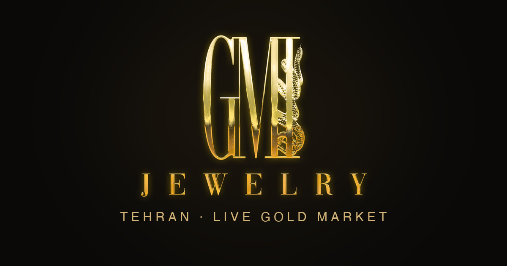

<div align="center">



# GMI Jewelry — Gold Trading App

**A mobile gold & coin trading app prototype.** Live two-way prices, buy/sell with a price-lock flow, holdings, ledger, and support chat. Farsi (RTL), Apple-native design, light + dark mode.

اپلیکیشن بازار طلای لحظه‌ای GMI — نسخه‌ی نمونه‌ی اولیه.

**[▶ Live demo](https://dannygmi.github.io/gmi-jewelry/)**  ·  **[📖 راهنمای فارسی](https://dannygmi.github.io/gmi-jewelry/guide.html)**  ·  **[📄 Guide PDF](https://dannygmi.github.io/gmi-jewelry/GMI-Guide-FA.pdf)**

</div>

---

> **Note:** This is a **visual prototype**. The UI, flows, and interactions are real, but it is **not connected to a backend** — no real orders are placed and the sign-in is a demo.

## Features

- **بازار / Market** — live two-way (buy/sell) prices, spot rail, inline sparklines, Stocks-style change pills, grouped by bullion (آبشده) and coins (سکه).
- **Trade flow** — product detail with candlestick chart + timeframes, Buy/Sell, a weight⇄cash converter, and a **price-lock confirm** (countdown ring, hold-to-confirm, honest expiry/requote, irreversibility).
- **سفارش / Orders** — order history with statuses.
- **گردش / Ledger** — double-entry account ledger (red = debit, blue = credit), grouped by date.
- **مانده / Balance** — gold holdings card with live P/L, quick actions, holdings + portfolio value.
- **چت / Chat** — department-routed support chat with attachments.
- **Light + Dark mode** (iOS system colors), full RTL Farsi, Jalali dates, tabular Persian numerals.

## Tech

Zero dependencies — vanilla **HTML / CSS / JavaScript**. Canvas-drawn charts (candlesticks, sparklines, area). [Vazirmatn](https://github.com/rastikerdar/vazirmatn) for Persian + Helvetica Neue for Latin. Apple-native design system (grouped inset lists, large titles, segmented controls, one "gold metal" card per screen, glass only on chrome).

## Run locally

```bash
# any static server works — file:// won't (relative fetches)
python3 -m http.server 8123
# then open http://localhost:8123/
```

## Structure

```
index.html              # app shell + all screens
guide.html              # Farsi user guide (printable → PDF)
manifest.json           # PWA / add-to-home-screen
assets/
  tokens.css            # design tokens (light + dark)
  app.css               # components
  app.js                # interactions (router, converter, price-lock, theme)
  charts.js             # canvas charts
  data.js               # mock data (Persian, seeded)
  fonts.css             # Helvetica + Vazirmatn
  brand/                # GMI logo (transparent monogram + lockup)
```

---

<div align="center"><sub>GMI Jewelry · Tehran · prototype</sub></div>
